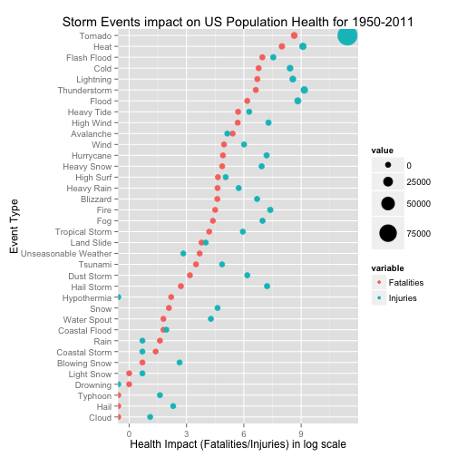
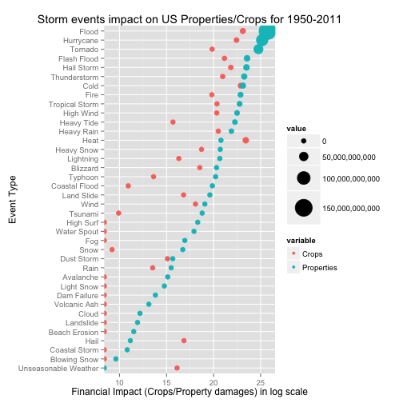

Shiny App for US Storm Data Analysis
========================================================
author: Sathish Duraisamy
date: 2015JAN24

Shiny App for Storm Data Analysis
========================================================

Introduction
Storms and other severe weather events can cause both public health and economic problems for communities and municipalities. Many severe events can result in fatalities, injuries, and property damage, and preventing such outcomes to the extent possible is a key concern.

- This Shiny App explores the US National Storm Data
- Lets the user choose the different impact targets
- And displays graph decpicting the most severe weather events

Data Processing
========================================================
This app uses a filtered extract of the detailed dataset
from US NOAA (National Oceanic and Atmospheric Administration)


```r
df <- read.csv("storm_data_analysis_short.csv", header=TRUE)
head(df, 4)
```

```
         evtype tot_fatal tot_injur tot_propdmg tot_cropdmg
1     Avalanche       225       170     3721800           0
2 Beach Erosion         0         0      100000           0
3      Blizzard       101       806   664913950   112060000
4  Blowing Snow         2        14       15000           0
```

Output - Storm events causing Fatalities/Injuries (Plot)
========================================================
This is the plot of Strom events impact on Human Life/Injuries

 

Output - Top 5 most severe Storm events causing Fatalities/Injuries (Text)
========================================================

```r
top_n_events <- head(arrange(dfh, -tot_fatal)[,c(1,2,3)], 5)
names(top_n_events) <- c("EventType", "TotalDeathCount", "TotalInjuryCount")
top_n_events
```

```
    EventType TotalDeathCount TotalInjuryCount
1     Tornado            5633            91364
2        Heat            2960             8864
3 Flash Flood            1064             1879
4        Cold             874             4531
5   Lightning             817             5231
```

Output - Storm events damaging Properties/Crops (Plot)
========================================================
This is the plot of Strom events impact on Human Life/Injuries
 


Output - Storm events damaging Properties/Crops (Text)
========================================================

```r
top_n_events <- head(arrange(dfp, -tot_propdmg)[,c(1,4,5)], 5)
names(top_n_events) <- c("EventType", "TotalPropertyDamage", "TotalCropDamage")
top_n_events
```

```
    EventType TotalPropertyDamage TotalCropDamage
1       Flood        150189663635     10842825950
2   Hurrycane         84756180010      5515292800
3     Tornado         56941932479       414961470
4 Flash Flood         16964543937      1540685250
5  Hail Storm         15974470043      3026094623
```
