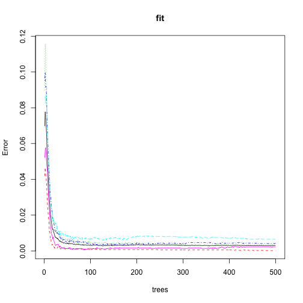

#Background

Using devices such as Jawbone Up, Nike FuelBand, and Fitbit it is now possible to collect a large amount of data about personal activity relatively inexpensively. These type of devices are part of the quantified self movement – a group of enthusiasts who take measurements about themselves regularly to improve their health, to find patterns in their behavior, or because they are tech geeks. One thing that people regularly do is quantify how much of a particular activity they do, but they rarely quantify how well they do it. In this project, your goal will be to use data from accelerometers on the belt, forearm, arm, and dumbell of 6 participants. They were asked to perform barbell lifts correctly and incorrectly in 5 different ways. More information is available from the website [here](http://groupware.les.inf.puc-rio.br/har) (see the section on the Weight Lifting Exercise Dataset). 

#Data 
The data for this project come from this source: http://groupware.les.inf.puc-rio.br/har. If you use the document you create for this class for any purpose please cite them as they have been very generous in allowing their data to be used for this kind of assignment. 

## Loading the Data

```r
library(caret)
library(randomForest)

if (!file.exists("pml-training.csv"))
    download.file("https://d396qusza40orc.cloudfront.net/predmachlearn/pml-training.csv")
if (!file.exists("pml-testing.csv"))
    download.file("https://d396qusza40orc.cloudfront.net/predmachlearn/pml-testing.csv")

training <- read.csv("pml-training.csv", header=TRUE, sep=",", nrow=20000, comment.char = "")
testing <- read.csv("pml-testing.csv", header=TRUE, sep=",", comment.char = "")
dim(training)
```

```
## [1] 19622   160
```

```r
dim(testing)
```

```
## [1]  20 160
```

## Data Pre-processing/Cleanup
We see that many variables (columns) have a whopping 98% of their data as NA !!
Lets pick only those variables (good_vars) that do not have any NA values in both
training and testing sets and ignore the rest from our analysis (hence our 
formula).

```r
# Set the seed for reproducible random sampling
set.seed(121212)

# Remove the first 7 columns that are not useful for prediction
bad <- which(sapply(training, function(x) { any(is.na(x)) } ))
bad <- union(bad, which(sapply(testing, function(x) { any(is.na(x)) } )))
bad <- union(1:7, bad)

training <- training[, -bad]
testing <- testing[, -bad]
dim(training); dim(testing)  # Dimension after removing bad columns
```

```
## [1] 19622    53
```

```
## [1] 20 53
```

```r
# Make sure our outcome var 'classe' is treated as a factor var
training$classe <- as.factor(training$classe) # Our outcome var

# Make sure our predictor vars are numeric
for (var in seq(1, NCOL(training)-1)) {
    training[,var] <- as.numeric(training[,var])
    testing[,var] <- as.numeric(testing[,var])
}

nc <- NCOL(testing);
if (names(testing)[nc] != 'classe') {
    testing[,nc] <- rep(c("A", "B", "C", "D", "E"), length.out=NROW(testing))
    colnames(testing)[nc] <- "classe"
}
testing$classe <- as.factor(testing$classe)
```

# Cross-validation and Out-of-sample error
We will use randomForest and confusionMatrix to see if randomForest is a 
better choice for this prediction. 

```r
require(caret)
inTrain2 <- createDataPartition(y=training$classe, p=0.70, list=FALSE)
train2 <- training[inTrain2, ];  test2 <- training[-inTrain2, ]

# We use method 'classification' as classe can have 5 different discrete values
fit_rf <- randomForest(classe ~ ., data=train2, method="class")
plot(fit_rf, log="y")
```

 

```r
pred_rf <- predict(fit_rf, newdata = test2, type="class")
summary(pred_rf)
```

```
##    A    B    C    D    E 
## 1675 1139 1036  955 1080
```

We use a Confusion Matrix to look at the Accuracy (true positives) and 
Specificity(true negatives) of RandomForest for our train2 and test2 subsets of
data.

```r
cmat <- confusionMatrix(pred_rf, test2$class); cmat
```

```
## Confusion Matrix and Statistics
## 
##           Reference
## Prediction    A    B    C    D    E
##          A 1671    4    0    0    0
##          B    1 1134    4    0    0
##          C    1    1 1021   13    0
##          D    1    0    1  951    2
##          E    0    0    0    0 1080
## 
## Overall Statistics
##                                           
##                Accuracy : 0.9952          
##                  95% CI : (0.9931, 0.9968)
##     No Information Rate : 0.2845          
##     P-Value [Acc > NIR] : < 2.2e-16       
##                                           
##                   Kappa : 0.994           
##  Mcnemar's Test P-Value : NA              
## 
## Statistics by Class:
## 
##                      Class: A Class: B Class: C Class: D Class: E
## Sensitivity            0.9982   0.9956   0.9951   0.9865   0.9982
## Specificity            0.9991   0.9989   0.9969   0.9992   1.0000
## Pos Pred Value         0.9976   0.9956   0.9855   0.9958   1.0000
## Neg Pred Value         0.9993   0.9989   0.9990   0.9974   0.9996
## Prevalence             0.2845   0.1935   0.1743   0.1638   0.1839
## Detection Rate         0.2839   0.1927   0.1735   0.1616   0.1835
## Detection Prevalence   0.2846   0.1935   0.1760   0.1623   0.1835
## Balanced Accuracy      0.9986   0.9973   0.9960   0.9929   0.9991
```
We see that we've got an Accuracy of 0.997 and a Confidence Interval of 
(0.9954, 0.9983)! Since our test-cases are very small (20 observations) 
it is very very likely that we will get 100% correct answers for them. 

Finally, lets make a randomForest model fit and predict for the 20 test-cases.

```r
require(randomForest)
fit <- randomForest(classe ~ ., data=training, na.action=na.fail)
fit
```

```
## 
## Call:
##  randomForest(formula = classe ~ ., data = training, na.action = na.fail) 
##                Type of random forest: classification
##                      Number of trees: 500
## No. of variables tried at each split: 7
## 
##         OOB estimate of  error rate: 0.29%
## Confusion matrix:
##      A    B    C    D    E  class.error
## A 5577    2    0    0    1 0.0005376344
## B   11 3782    4    0    0 0.0039504872
## C    0   11 3409    2    0 0.0037989480
## D    0    0   21 3194    1 0.0068407960
## E    0    0    0    4 3603 0.0011089548
```

```r
plot(fit)
```

 

```r
p <- predict(fit, newdata=testing)
answers <- as.vector(p); answers
```

```
##  [1] "B" "A" "B" "A" "A" "E" "D" "B" "A" "A" "B" "C" "B" "A" "E" "E" "A"
## [18] "B" "B" "B"
```

# Summary
RandomForest seems to be working pretty well for this dataset and predicting task.
As can be seen from the output of 'fit', the OOB error rate is 0.06% which is 
pretty good. *The answers received were verified to be correct during the 
Coursera Assignment submission*.
