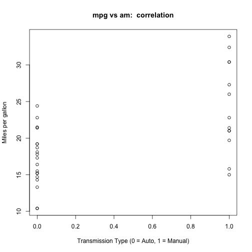
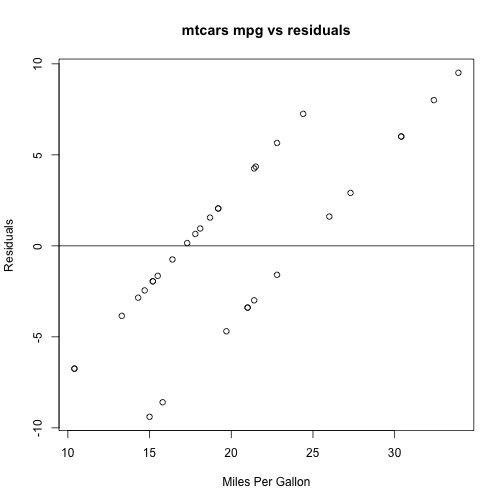

# Context:
The Motor Trend, an automobiles magazien company would like the answers for
the following questions, looking at a particular dataset: mtcars.

    1. Is an automatic or manual transmission better for MPG?
    2. Quantify the MPG difference between automatic and manual transmissions

# Exploratory Data Analysis
We will take a look at:
    *the dimension of the dataset
    *how many variables are there and their names, classes (are there any factors)
    * first few observations of dataset
    *how are the vars correlated to each other (with a pairs plot)
       and also numerically with a cor() function call.
    *etc.,

```r
library(datasets)
data(mtcars)

dim(mtcars)
```

```
## [1] 32 11
```

```r
names(mtcars)
```

```
##  [1] "mpg"  "cyl"  "disp" "hp"   "drat" "wt"   "qsec" "vs"   "am"   "gear"
## [11] "carb"
```

```r
head(mtcars, 3)
```

```
##                mpg cyl disp  hp drat    wt  qsec vs am gear carb
## Mazda RX4     21.0   6  160 110 3.90 2.620 16.46  0  1    4    4
## Mazda RX4 Wag 21.0   6  160 110 3.90 2.875 17.02  0  1    4    4
## Datsun 710    22.8   4  108  93 3.85 2.320 18.61  1  1    4    1
```

# Coefficient Interpretation

```r
cor(mtcars$mpg, mtcars[, -c(1)])
```

```
##            cyl       disp         hp      drat         wt     qsec
## [1,] -0.852162 -0.8475514 -0.7761684 0.6811719 -0.8676594 0.418684
##             vs        am      gear       carb
## [1,] 0.6640389 0.5998324 0.4802848 -0.5509251
```
See appendix for a plot of the variables: mpg vs am. The 'am' var DOES have a 
postive correlation (0.5998324) meaning: *as the tranmission type increases 
from 0(Auto) to 1(Manual) we see an increase in mpg*. We'll further
confirm and quantify this coef for the two categories ('Auto' and 'Manual') of am.

Convert 'am' to a factor var, and add it to dataset for ease with fitting & plotting

```r
mtcars$am <- as.factor(mtcars$am); levels(mtcars$am) <- c("Auto", "Manual")
```

# Question 1: Would Auto or Manual transmission give better MPG?
We will do a Student t-test with 95% confident interval to see which one category
is more likely.

```r
t.test(mtcars$mpg ~ mtcars$am, confid.level=0.975)
```

```
## 
## 	Welch Two Sample t-test
## 
## data:  mtcars$mpg by mtcars$am
## t = -3.7671, df = 18.332, p-value = 0.001374
## alternative hypothesis: true difference in means is not equal to 0
## 95 percent confidence interval:
##  -11.280194  -3.209684
## sample estimates:
##   mean in group Auto mean in group Manual 
##             17.14737             24.39231
```
The p-value 0.001374 and estimated means of Auto vs Manual (24.39) suggest that
Manual transmission is more likely to give better MPG than Auto.

# Question 2: How to quantify the MPG diff between Auto and Manual transmissions?
To answer this, we will use 'Linear Regression' and fit multiple models:
first with both values of 'am', then with 'qsec' kept at a constant and seeing 
for 'am' vaues == 0 (Auto) and 'am' valus = 1 (Manual). We will then compare 
these models using 'anova'.

```r
fit1 <- lm(mpg ~ am, data=mtcars)
fit2 <- lm(mpg ~ I(factor(am)):qsec, data=mtcars)
summary(fit2)
```

```
## 
## Call:
## lm(formula = mpg ~ I(factor(am)):qsec, data = mtcars)
## 
## Residuals:
##     Min      1Q  Median      3Q     Max 
## -6.3306 -2.2453  0.1917  2.3112  6.9815 
## 
## Coefficients:
##                          Estimate Std. Error t value Pr(>|t|)    
## (Intercept)              -15.3005     6.2226  -2.459   0.0201 *  
## I(factor(am))Auto:qsec     1.7815     0.3419   5.211 1.41e-05 ***
## I(factor(am))Manual:qsec   2.2911     0.3590   6.383 5.61e-07 ***
## ---
## Signif. codes:  0 '***' 0.001 '**' 0.01 '*' 0.05 '.' 0.1 ' ' 1
## 
## Residual standard error: 3.364 on 29 degrees of freedom
## Multiple R-squared:  0.7086,	Adjusted R-squared:  0.6885 
## F-statistic: 35.26 on 2 and 29 DF,  p-value: 1.716e-08
```
# Executive Summary
From the summary(fit2) output, we could say, during the '1/4 mile time'(qsec), 
a car with Manual transmission gives 2.2911 MPG more while a car with Auto
transmission will only give 1.7815 MPG. 
See appendix for a Residual plot of this fitted model.


```r
anova(fit1, fit2)
```

```
## Analysis of Variance Table
## 
## Model 1: mpg ~ am
## Model 2: mpg ~ I(factor(am)):qsec
##   Res.Df    RSS Df Sum of Sq      F    Pr(>F)    
## 1     30 720.90                                  
## 2     29 328.11  1    392.79 34.717 2.142e-06 ***
## ---
## Signif. codes:  0 '***' 0.001 '**' 0.01 '*' 0.05 '.' 0.1 ' ' 1
```
Anova output supports our findings.

-------
#Appendix

## scatterplot of mtcars (mpg vs am) to visually explore how they are correlated

```r
data(mtcars)
plot(mtcars$am, mtcars$mpg, xlab="Transmission Type (0 = Auto, 1 = Manual)",
     ylab="Miles per gallon", main="mpg vs am:  correlation" )
```

 

## Residuals plotted

```r
residuals <- resid(fit1)
plot(mtcars$mpg, residuals, ylab="Residuals", 
     xlab="Miles Per Gallon", 
     main="mtcars mpg vs residuals") 
abline(0, 0)
```

 

--end--
