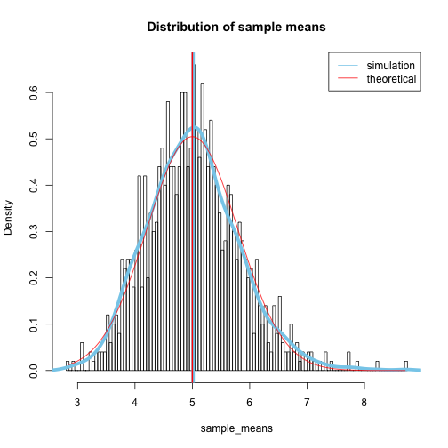

#Overview
In this project we will investigate the exponential distribution in R and 
compare it with the Central Limit Theorem. The exponential distribution 
can be simulated in R with rexp(n, lambda) where lambda is the rate parameter.
The mean of exponential distribution is 1/lambda and the standard deviation
is also 1/lambda. We'll set lambda = 0.2 for all of the simulations. You will
investigate the distribution of averages of 40 exponentials. Note that you 
will need to do a thousand simulations.

#Simulation
We will create a sample of 40 from exponential distribution and we will
repeat this sampling 1000 times creating a matrix of dimension 1000 x 40

```r
lambda <- 0.2
num_expo <- 40
num_simul <- 1000

set.seed(121212)  # Set seed for reproducibility of random sampling
dat <- NULL
for (i in 1:num_simul) {
  row <- rexp(num_expo, lambda)
  dat <- rbind(dat, row);
}
dim(dat)
```

```
## [1] 1000   40
```

# Objective 1: Sample mean: Compare with Theoretical mean
Given a population with a finite mean mu and a finite non-zero variance sigma^2,
the sampling distribution of the mean approaches a normal distribution with
a mean of mu and a variance of (sigma^2)/N as N, the sample size, increases.

We will calculate the mean of the sample means, plot the histogram of the 
sample means and draw vertical line around the center (mean of sample-means) 
of it.  We will then draw the lines for theoretical values and compare them 
against each other visually.

```r
sample_means <- rowMeans(dat)

h <- hist(sample_means, breaks=200, probability = T, main = "Distribution of sample means")
lines(density(sample_means), col="skyblue", lwd=5)
# Draw a vertical line at the center of sample distribution
mean_of_sample_means <- mean(sample_means)
abline(v=mean_of_sample_means, col="skyblue", lwd=5)

# Draw another lincurve as per theoretical values
theor_x <- seq(min(sample_means), max(sample_means), length=200)
theor_y <- dnorm(theor_x, mean=1/lambda, sd=(1/lambda/sqrt(num_expo)))
lines(theor_x, theor_y, pch=20, col="red", lwd=1)

# Draw a vertical line at the center of theoretical distribution
theoretical_mean <- 1 / lambda
abline(v=theoretical_mean, col="red", lwd=2)
legend("topright", legend = c("simulation", "theoretical"),
       lty = c(1,1), col = c("skyblue", "red"))
```

 

```r
message(paste("mean-of-sample-means = ", round(mean_of_sample_means, 5),
              "   theoretical-men = ", round(theoretical_mean, 5), "\n", sep=""))
```

```
## mean-of-sample-means = 5.01422   theoretical-men = 5
```

# Objective 2: Sample variance: Compare it with theoretical variance
We will calculate the variance of the sample means and the theoretical
variance using the formula (1/lambda/sqrt(number-of-samples))^2 and 
and compare them.

```r
var_of_sample_means <- var(sample_means)
theoretical_var <- (1/lambda/sqrt(num_expo))^2

message(paste("variance-of-sample-means = ", round(var_of_sample_means, 5),
              "   theoretical-variance = ", round(theoretical_var, 5), "\n", sep=""))
```

```
## variance-of-sample-means = 0.63992   theoretical-variance = 0.625
```

# Objective 3: Show that the distribution is approximately normal
As can be seen from the histogram plot above, the sample mean and theoretical
mean are very close. The blue vertical line represents the center of 
sample means (5.01422) and the red vertical line represents the 
theoretical-mean == 1/lambda == 1/0.2 == 5. The two means are very close and 
the same for sample and theoretical variances (0.63992 and 0.625 respectively).
As we increase the sample size, the distribution eventually becomes very close 
to being a normal distribution. 

--end--
